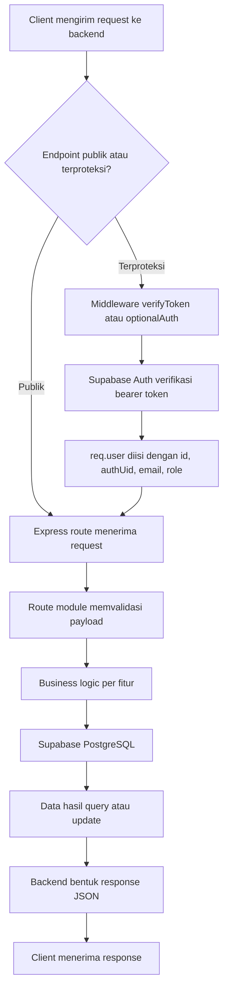
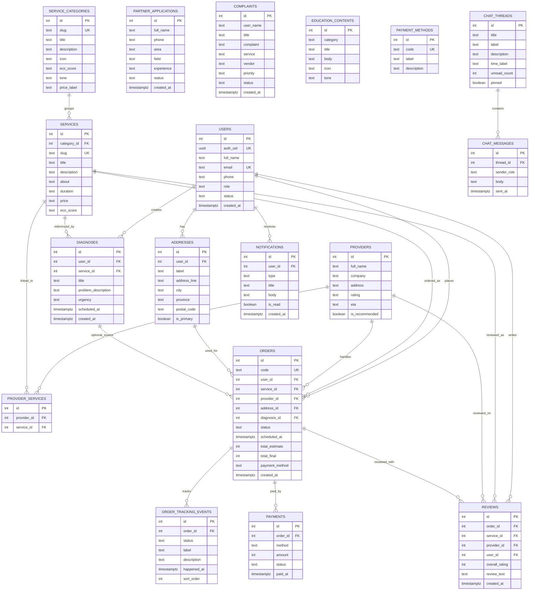
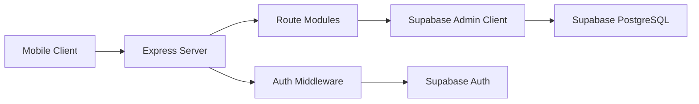

# Backend Technical Documentation

## Gambaran Umum

`backend-mobile` adalah API server berbasis Express.js yang menangani autentikasi, katalog layanan, diagnosis, order, chat, notifikasi, partner application, dan dashboard admin. Backend ini terhubung ke Supabase Auth untuk verifikasi token dan Supabase PostgreSQL untuk penyimpanan data aplikasi.

## Diagram Alur Sistem Backend



## ERD / Model Data



## Diagram Arsitektur Sistem Backend



## API Dokumentasi

### Base URL

```text
http://localhost:3000
```

### Health dan metadata

| Method | Endpoint | Keterangan |
| --- | --- | --- |
| GET | `/health` | Health check backend |
| GET | `/api/meta` | Metadata backend |

### Auth

| Method | Endpoint | Auth | Fungsi |
| --- | --- | --- | --- |
| POST | `/api/auth/register` | No | Registrasi user |
| POST | `/api/auth/login` | No | Login user atau admin |
| GET | `/api/auth/me` | Bearer | Ambil profil user aktif |
| PATCH | `/api/auth/profile` | Bearer | Ubah profil user |
| POST | `/api/auth/change-password` | Bearer | Ganti password |
| POST | `/api/auth/logout` | Bearer | Logout |

### Services

| Method | Endpoint | Auth | Fungsi |
| --- | --- | --- | --- |
| GET | `/api/service-categories` | No | Daftar kategori layanan |
| GET | `/api/services` | No | Daftar layanan |
| GET | `/api/services/:slug` | No | Detail layanan |
| GET | `/api/services/:slug/providers` | No | Provider per layanan |

### Orders dan diagnosis

| Method | Endpoint | Auth | Fungsi |
| --- | --- | --- | --- |
| POST | `/api/diagnoses` | Optional Bearer | Buat diagnosis |
| GET | `/api/orders` | Optional Bearer | Daftar order |
| GET | `/api/orders/:id` | No | Detail order |
| GET | `/api/orders/:id/tracking` | No | Tracking order |
| POST | `/api/orders` | Optional Bearer | Buat order |
| POST | `/api/orders/:id/payments/confirm` | No | Konfirmasi pembayaran |
| POST | `/api/orders/:id/reviews` | Optional Bearer | Kirim review |

### Chat dan konten pendukung

| Method | Endpoint | Auth | Fungsi |
| --- | --- | --- | --- |
| GET | `/api/chat/threads` | No | Ambil thread chat |
| GET | `/api/chat/threads/:id/messages` | No | Ambil pesan chat |
| POST | `/api/chat/threads/:id/messages` | No | Kirim pesan chat |
| GET | `/api/notifications` | Optional Bearer | Ambil notifikasi |
| PATCH | `/api/notifications/:id/read` | No | Tandai notifikasi dibaca |
| GET | `/api/education` | No | Ambil konten edukasi |
| GET | `/api/payment-methods` | No | Ambil metode pembayaran |
| GET | `/api/partner-applications` | No | Daftar partner application |
| POST | `/api/partner-applications` | No | Kirim partner application |

### Admin

Semua endpoint admin membutuhkan bearer token dengan role `admin`.

| Method | Endpoint | Fungsi |
| --- | --- | --- |
| GET | `/api/admin/dashboard` | Statistik dashboard admin |
| GET | `/api/admin/partner-applications` | Daftar partner application |
| POST | `/api/admin/partner-applications/:id/approve` | Approve partner |
| POST | `/api/admin/partner-applications/:id/reject` | Reject partner |
| GET | `/api/admin/complaints` | Daftar komplain |
| POST | `/api/admin/complaints/:id/process` | Proses komplain |
| GET | `/api/admin/users` | Daftar user |
| GET | `/api/admin/users/:id` | Detail user |
